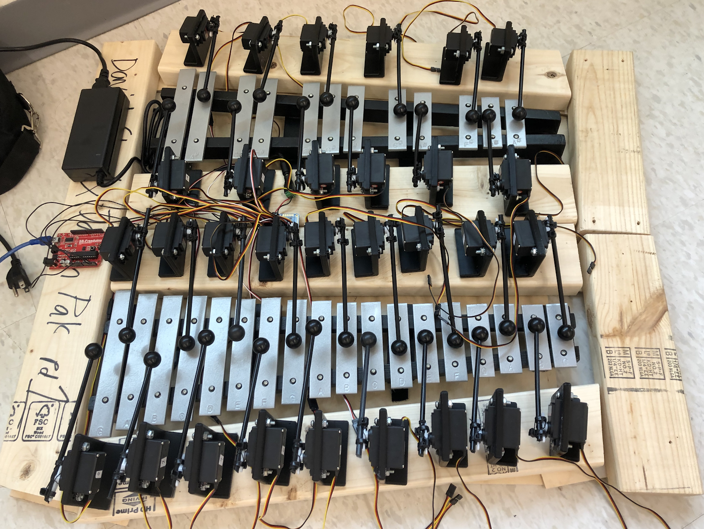
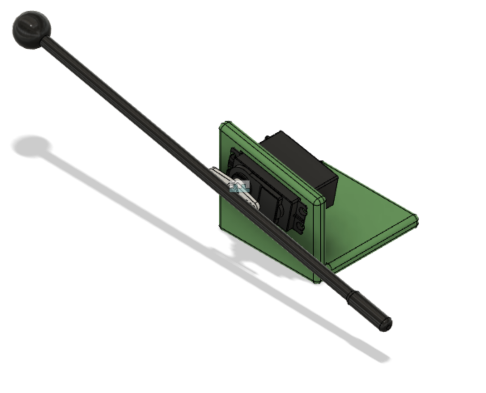

# Bot-thoven

This repository contains the code used to build **Bot-thoven**, a xylophone-playing robot that I built during my Senior Year in High School. 

I worked on this project with my friend David Cha. My individual responsibilities included familiarizing myself with the ***ARDUINO*** platform – *a microcontroller that we used to program the motors of our robot.*

## Demo Video
For a demonstration video of Bot-thoven in action, please view the [Bot-thoven Demo Video](https://youtu.be/9Ag7zkTR_XE).

## Project Website
Please visit the [Project Website](https://hackaday.io/project/167574-bot-thoven-a-robot-musician) for more details about the Bot-thoven Project.

# Details
Below is an image mockup of the servo-mallet system that we constructed for this project:

We built one servo-mallet system for each xylophone key. The Arduino platform was used to control the movement of each individual servo-mallet system. 

Below is an image of the final servo-mallet system used in this project:

The [Starter Code](bot-thoven_starter.ino) that I wrote for this project is included in this repository. 

This program facilitates controlling the servo motors to play each individual note for the project. The program allows the user to control each servo motor to rotate to a desired value, in order to strike the xylophone key and play the appropriate musical note.

This starter code is a template that can be modified to have Bot-thoven perform any desired tune that the user wishes to have the robot play.

